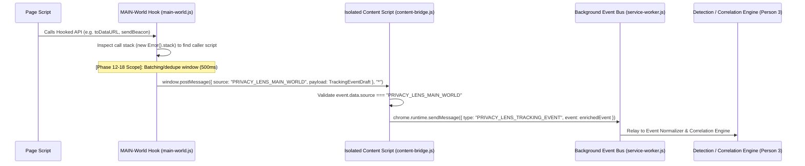

# Phase 0-2: Architecture Lock Specification

**Product**: Privacy Lens — Tracking Forensics Browser Extension  
**Role**: Person 2 — Browser Forensics (Fingerprint Detection)  
**Deliverable**: Architecture Contract Sign-Off, Branch Strategy & Stub Scaffolding

---

## 1. TrackingEvent Schema Agreement

All extension components (Person 1 Network Intelligence, Person 2 Browser Forensics, Person 3 Detection & Correlation Engine) emit and consume events conforming to this canonical `TrackingEvent` JSON structure:

```json
{
  "id": "evt_1726123000000_a1b2c3",
  "timestamp": 1726123000000,
  "tabId": 41,
  "site": "news-site.com",
  "category": "fingerprinting",
  "subtype": "canvas",
  "source": {
    "script": "https://cdn.example.com/tracker.js"
  },
  "target": {
    "domain": "tracker.example.com"
  },
  "evidence": {
    "api": "HTMLCanvasElement.toDataURL",
    "details": {}
  },
  "severity": "low",
  "confidence": 0.0
}
```

### Person 2 Field Contracts & Population Rules

| Field | Type | Person 2 Population Rule | Example |
| :--- | :--- | :--- | :--- |
| `id` | `string` | Unique event ID (`evt_<timestamp>_<rand>`) generated by creator or bridge/bus. | `"evt_1726123000123_x8z1"` |
| `timestamp` | `number` | Epoch milliseconds when API was accessed. | `1726123000123` |
| `tabId` | `number` | Populated by content script/background bus runtime from sender tab context. | `41` |
| `site` | `string` | Top-level site hostname where access occurred. | `"news-site.com"` |
| **`category`** | `string` | **Always `"fingerprinting"`** for Person 2 modules. | `"fingerprinting"` |
| **`subtype`** | `string` | Exact vector: `"canvas"`, `"webgl"`, `"audio"`, `"storage"`, `"beacon"`, `"font"`. | `"canvas"` |
| **`source.script`** | `string` | Caller script URL extracted from stack trace (`new Error().stack`). | `"https://cdn.example.com/fp.js"` |
| **`target.domain`** | `string \| undefined` | **Populated ONLY for network transmission subtypes** (`"beacon"`, `"fetch"`, `"xhr"`): extract destination hostname (e.g. `"analytics.example.net"` to power the evidence chain `Identifier transmitted → target`). For `"canvas"`, `"webgl"`, `"audio"`, `"storage"`, and `"font"`, leave as `undefined` (omitted) since there is no remote network destination. | `"analytics.example.net"` |
| **`evidence.api`** | `string` | Exact hooked API method or property accessed. | `"HTMLCanvasElement.toDataURL"` |
| `evidence.details` | `object` | Optional non-PII parameters (e.g. WebGL query name, storage key name). | `{"parameter": "RENDERER"}` |
| `severity` | `string` | Default `"low"`. Final severity band computed by Person 3 scoring rules. | `"low"` |
| **`confidence`** | `number` | **Left as placeholder (`0.0`)**. Person 2 does NOT calculate confidence; Person 3's correlation engine scores signal combinations. | `0.0` |

---

## 2. Messaging Contract

Communication crosses the Chrome MV3 boundary from page execution (MAIN world) to background event bus:



### Exact Message Shapes

#### 1. Page-to-Content Bridge (`window.postMessage`)
```javascript
window.postMessage({
  source: "PRIVACY_LENS_MAIN_WORLD",
  payload: {
    category: "fingerprinting",
    subtype: "canvas", // "canvas" | "webgl" | "audio" | "storage" | "beacon" | "font"
    source: {
      script: "https://cdn.example.com/tracker.js"
    },
    target: undefined, // Or { domain: "analytics.example.net" } for beacon/fetch
    evidence: {
      api: "HTMLCanvasElement.toDataURL",
      details: {}
    },
    timestamp: 1726123000000
  }
}, "*");
```
> [!NOTE]
> `window.postMessage(..., '*')` is an agreed hackathon simplification. In standard extensions `window.location.origin` is stricter, but given same-tab origin matching and our strict `source === "PRIVACY_LENS_MAIN_WORLD"` validation check in `content-bridge.js`, this is secure and lightweight for the hackathon build.

#### 2. Content-to-Background Bus (`chrome.runtime.sendMessage`)

##### A. Batched & Deduplicated Events (Default from Phase 12–18 onwards)
Dispatched by `content-bridge.js` after a 500ms sliding window:
```javascript
chrome.runtime.sendMessage({
  type: "PRIVACY_LENS_BATCH_EVENTS",
  payload: [
    {
      category: "fingerprinting",
      subtype: "canvas",
      source: { script: "https://cdn.example.com/tracker.js" },
      target: undefined, // Populated with { domain: "..." } for beacon/fetch/xhr
      evidence: {
        api: "HTMLCanvasElement.toDataURL",
        details: { format: "image/png" }
      },
      count: 12, // Number of identical calls within the 500ms window
      timestamp: 1726123000000,
      severity: "low",
      confidence: 0.0
    }
  ]
});
```

##### B. Single Event (Legacy / Immediate fallback)
```javascript
chrome.runtime.sendMessage({
  type: "PRIVACY_LENS_TRACKING_EVENT",
  event: {
    category: "fingerprinting",
    subtype: "canvas",
    source: { script: "https://cdn.example.com/tracker.js" },
    target: undefined,
    evidence: { api: "HTMLCanvasElement.toDataURL", details: {} },
    timestamp: 1726123000000,
    severity: "low",
    confidence: 0.0
  }
});
```

> [!IMPORTANT]
> **Scoring Engine Semantics for Person 3 (`count` field)**:
> - **Signal Presence**: Base vector weights (e.g. `canvas = 3`, `cookie reuse = 2`) apply per unique script/subtype combination in the correlation graph.
> - **High-Frequency Probing**: The `count` attribute signifies rapid polling (e.g. Canvas font rendering loops or high-rate WebGL queries). Person 3's correlation engine uses `count > 5` within a short window as a confidence multiplier rather than linear score inflation.

---

## 3. Platform, Browser & Build Pipeline Requirements
- **Chrome Version**: **Chrome 111+ required**.
  - MV3's native `"world": "MAIN"` content-script declaration eliminates legacy script injection hacks and allows synchronous hook registration at `document_start`.
  - **Checklist Item**: Verify dev and demo machines run Chrome $\ge$ 111.
- **Content Script Execution & Bundling (esbuild IIFE)**:
  - **MV3 Rule**: Chrome MV3 `content_scripts` (both `"world": "MAIN"` and `"world": "ISOLATED"`) execute as **classic non-module scripts** and do not support top-level ES module `import`/`export` statements.
  - **Build Strategy**: `esbuild` compiles modular source files into standalone IIFEs:
    - `extension/fingerprint/main-world.js` (+ imports: `canvas.js`, `webgl.js`, `audio.js`, `fonts.js`, `storage.js`) $\rightarrow$ `extension/dist/main-world.bundle.js` (`format: 'iife'`).
    - `extension/content/content-bridge.js` (+ imports: `shared/constants.js`) $\rightarrow$ `extension/dist/content-bridge.bundle.js` (`format: 'iife'`).
  - `manifest.json` points directly to `dist/main-world.bundle.js` and `dist/content-bridge.bundle.js`.
  - **`web_accessible_resources`**: **Not required**. Since all scripts are injected natively by Chrome via `content_scripts` manifest declarations (rather than dynamically fetched via `fetch(chrome.runtime.getURL(...))` or injected via `<script src="...">` tags by the page), no `web_accessible_resources` declaration is necessary.

---

## 4. Shared Repository Structure & Ownership

All team members work within a single shared repository `privacy-lens/`:

```
privacy-lens/
├── package.json                 # Build scripts & esbuild devDependency
├── build.js                     # esbuild bundler configuration
├── extension/
│   ├── manifest.json            # Shared MV3 configuration pointing to dist/
│   ├── dist/                    # Bundled IIFE scripts for content_scripts
│   │   ├── main-world.bundle.js
│   │   └── content-bridge.bundle.js
│   ├── background/              # Background service worker & event bus
│   │   ├── service-worker.js
│   │   ├── event-bus.js
│   │   └── storage.js
│   ├── network/                 # Person 1 (Network Intelligence)
│   │   ├── interceptor.js
│   │   ├── etag-detector.js
│   │   ├── cache-detector.js
│   │   ├── cname-detector.js
│   │   ├── thirdparty-detector.js
│   │   └── tracker-list.js
│   ├── fingerprint/             # Person 2 (Browser Forensics)
│   │   ├── main-world.js        # MAIN world hook coordinator & dispatcher
│   │   ├── canvas.js            # Canvas 2D fingerprint hooks
│   │   ├── webgl.js             # WebGL / WebGL2 context hooks
│   │   ├── audio.js             # AudioContext / OfflineAudioContext hooks
│   │   ├── fonts.js             # FontFace / document.fonts hooks
│   │   └── storage.js           # Storage, Cookie, and Beacon hooks
│   ├── detection/               # Person 3 (Scoring & Correlation)
│   │   ├── classifier.js
│   │   ├── scoring.js
│   │   └── correlation.js
│   ├── ui/                      # Person 3 (Side Panel UI)
│   │   ├── sidepanel.html
│   │   ├── sidepanel.js
│   │   └── styles.css
│   ├── content/                 # Content scripts
│   │   └── content-bridge.js    # Isolated-world forwarder to background bus
│   └── shared/                  # Shared types, constants, validators
│       ├── constants.js
│       ├── events.js
│       └── utils.js
├── tracker-lab/                 # Test pages (owned by Person 3, all contribute triggers)
│   ├── canvas.html
│   ├── webgl.html
│   ├── audio.html
│   ├── storage.html
│   ├── beacon.html
│   └── combined.html
├── data/
│   └── tracker-domains.json
└── docs/
    └── ARCHITECTURE_LOCK.md
```

---

## 5. Branch & Integration Strategy

To prevent merge conflicts across shared files while keeping parallel velocity:
1. **Branch Model**:
   - `main`: Protected trunk, always deployable for demo.
   - `feature/person-1-network`: Person 1 feature development.
   - `feature/person-2-fingerprint`: Person 2 feature development.
   - `feature/person-3-intelligence-ui`: Person 3 feature development.
2. **Shared Code Hygiene**:
   - `extension/shared/events.js` and `extension/shared/constants.js` are locked in Phase 0-2. Any schema change requires consensus.
3. **Scheduled Merge Checkpoints**:
   - **Hour 18–24**: First Real Integration (Wire network & fingerprint events into event bus $\rightarrow$ confirm UI flow).
   - **Hour 24–32**: Intelligence Layer merge (Wire correlation rules).
   - **Hour 40–44**: Demo freeze & `tracker-lab` verification.

---

## 6. Schedule & Implementation Scope Notes
- **Phase 0–2 (Current)**: Architecture Lock, message shapes, build pipeline (esbuild IIFE), directory scaffolding, empty stubs.
- **Phase 2–12**: Implement Tier 1 MAIN-world hooks (Canvas, WebGL, AudioContext, navigator.*, document.cookie, localStorage, sendBeacon, fetch, XHR).
- **Phase 12–18**: Call-stack attribution (`new Error().stack`), fonts, event batching/dedup (500ms window).

**Signed Off by**: Person 2 (Browser Forensics)

---

## Addendum: Hour 18-24 Integration Notes (Person 1 + Person 2 merge)

Two deviations from the plan above, made during the first real integration
pass, both driven by Person 1's already-working code rather than by
changing this doc's plan retroactively without reason:

1. **No nested `extension/` folder.** Person 1's network detectors call
   `chrome.runtime.getURL("data/tracker-domains.json")`, which resolves
   relative to wherever `manifest.json` lives. Since Person 1's working
   code already assumed `manifest.json`, `data/`, `network/`, `shared/`,
   and `panel/` are siblings at the repo root, the merged repo drops the
   `extension/` nesting layer entirely — `privacy-lens/` itself is the
   loadable extension package. `network/`, `fingerprint/`, `content/`,
   `dist/`, `shared/`, `panel/`, and `lib/` (new — see below) all live
   directly under the repo root now, not under `extension/`.
2. **`background/service-worker.js` → `background.js`.** The stub path
   this doc specifies was never created by either person; Person 1's
   working `background.js` (repo root) already boots the network
   interceptor and side panel behavior. That file is now also where
   Person 2's fingerprint event batches get received and finalized into
   real `TrackingEvent`s — see `docs/EVENT_SCHEMA_REFERENCE.md`'s
   "RESOLVED" section for how the schema drift between the two people's
   code was reconciled at that boundary.

One addition not in the original plan: `lib/store.js` (Person 1) — SHA-256
hashes any raw identifier before storage/display, and persists events
incrementally to `chrome.storage.session` (never buffered in memory, since
the MV3 service worker can be killed ~30s after going idle).

`extension/ui/` (Person 3's planned Live Feed / Graph / Score UI) was a
placeholder path in this doc's original layout. Person 3's real UI has
since landed at `ui/sidepanel.html` / `ui/sidepanel.js` / `ui/sidepanel.css`
(dropping the `extension/` prefix per the layout note above), replacing
Person 1's original `panel/panel.html` debug view entirely — see the
second integration addendum below.

---

## Addendum: Person 3 UI Integration

Person 3's side panel (Live Feed, per-site stats, dashboard counters, JSON
export) replaces Person 1's placeholder `panel/` debug view. Two gaps had
to be closed to wire the real UI to the real pipeline, since Person 3's
original prototype was built and demoed against mock events, with its own
standalone `background.js`:

1. **Schema mismatch.** Person 3's UI expected `{ type, domain, severity:
   "HIGH", timestamp }`. The real pipeline produces canonical
   `TrackingEvent`s (`category`/`subtype`/`source`/`target`/`evidence`,
   lowercase `severity`) — see `docs/EVENT_SCHEMA_REFERENCE.md`.
   `ui/event-display.js` is the adapter: `typeLabelFor()` maps
   `category:subtype` to the human-readable labels the feed shows (e.g.
   `fingerprinting:canvas` → "CANVAS FINGERPRINT"), `domainFor()` prefers
   the tracker's `target.domain` and falls back to the browsed `site` for
   pure fingerprint reads that have no remote endpoint, and
   `severityUpper()` handles the lower/upper case difference. Covered by
   `tests/test-event-display.js`.
2. **No persistence across panel opens.** Person 3's original `sidepanel.js`
   only ever held events pushed to it live during the current panel
   session — closing and reopening the panel lost everything. It now calls
   `getAllEvents()` from `lib/store.js` on open (the same
   `chrome.storage.session`-backed store Person 1 built for the network
   detectors) and listens for the `"pl_new_event"` message that
   `appendEvent()` already broadcasts, instead of the prototype's separate
   `TRACKING_EVENT` / `NEW_TRACKING_EVENT` message pair and standalone
   `background.js` (removed — `background.js` at the repo root already
   covers `sidePanel.setPanelBehavior()`).

Also wired up: the "Per-Site Analysis" section existed in Person 3's HTML
but was never populated in the original JS — it now shows a per-site
event/severity breakdown from real data. The mock "TEST EVENTS" block
(`sidepanel.js` section 12 in the original) was removed per its own
in-code comment, since real detectors are now connected.

---

## Addendum: Phase 24–32 Confidence & Correlation Engine Integration

In Phase 24–32, Person 3's Intelligence & Correlation Engine landed at
`detection/confidence-engine.js`, `detection/scoring.js`, and
`detection/classifier.js`. It activates inside `background.js` during the
finalization of Person 2's fingerprint draft batches, replacing the initial
placeholder confidence `0.0` with live forensic correlation scoring:

1. **Temporal & Script Correlation Window**:
   - Maintains a **10-second sliding correlation window** per `(site, tabId, scriptUrl)`
     session context.
   - Accurately distinguishes isolated benign operations (e.g. `WebGL.getParameter(MAX_TEXTURE_SIZE)`
     or `screen.width` for responsive UI) from aggressive multi-vector fingerprinting.

2. **Vector Weights, Diversity & Diminishing Returns**:
   - **Vector Weights**:
     - WebGL Unmasked GPU (`UNMASKED_RENDERER_WEBGL`, `UNMASKED_VENDOR_WEBGL`): `4.0`
     - Silent Audio Fingerprinting (`OfflineAudioContext.startRendering`): `4.0`
     - Canvas Readback (`toDataURL`, `toBlob`, `getImageData`): `3.0`
     - Font Enumeration Loop (`FontFaceSet.check` loop): `3.0` (Single font check: `0.2`)
     - Device Attribute Sweep ($\ge 3$ properties across `screen.*`/`navigator.*`): `2.5` (Single: `0.1`)
     - WebGL Capability Check (`MAX_TEXTURE_SIZE`): `0.3` (Benign baseline)
     - Outbound Beacon Exfiltration (`sendBeacon`, `fetch`, `XHR`): `3.5`
   - **Diminishing Returns Formula**: Within the same vector group, subsequent calls
     yield diminishing weight: $\text{additional} = \max(0, \text{weight} - \text{current} \times 0.4)$, capped at `8.0` per group.
   - **Diversity Bonuses**: Multi-vector combinations apply diversity floors ($\ge 2$ vectors $\rightarrow \ge 0.55$, $\ge 3$ vectors $\rightarrow \ge 0.85$, $\ge 4$ vectors $\rightarrow \ge 0.90$).
   - **Full Exfiltration Chain**: When a script gathers fingerprint vectors and initiates an outbound beacon/fetch/xhr within the 10s window, confidence rises to $\ge 0.95$ (`high` severity) with active exfiltration forensic notes.

3. **Severity Threshold Alignment Across All Modules**:
   - `high`: $\text{confidence} \ge 0.70$
   - `medium`: $0.40 \le \text{confidence} < 0.70$
   - `low`: $\text{confidence} < 0.40$
   *(Now strictly consistent across Person 3's confidence engine and Person 1's network detectors: `etag-detector.js` scores 0.05–0.95 across reuse/spread; `cache-detector.js` scores immutable tokens at 0.75 [high] and long max-age tokens at 0.55 [medium]; `cname-detector.js` scores live DoH at 0.90 [high]; `thirdparty-detector.js` scores data beacons at 0.80 [high] and third-party loads at 0.55 [medium]).*

4. **Probing Rate Multipliers**:
   - $\text{count} > 5 \rightarrow 1.5\times$
   - $2 \le \text{count} \le 5 \rightarrow 1.25\times$
   - $\text{count} \le 1 \rightarrow 1.0\times$

5. **Architectural Note — Dual Vantage Point on Outbound Beacons**:
   - Outbound requests to tracker endpoints can be flagged from two complementary perspectives:
     1. **DOM Hook (Person 2)**: Intercepts `navigator.sendBeacon` / `fetch` inside page context (`category: "fingerprinting"`, `subtype: "beacon"`, knowing caller `source.script`).
     2. **Network Wiretap (Person 1)**: Intercepts requests via `chrome.webRequest` (`category: "network"`, `subtype: "beacon"` or `"third-party-load"`).
   - This provides independent corroboration across the DOM/Network boundary. However, in `ui/sidepanel.js`, distinct `(category, subtype)` pairs count toward the aggregate `trackerScore`. If desired before demo freeze (Phase 40-44), a cross-layer deduplicator can bridge network events into the correlation engine.


